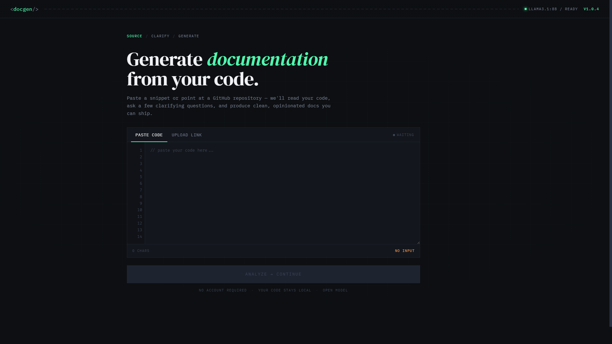

# docgen — AI-Powered Documentation Generator

[](https://vitejs.dev/)
[](https://react.dev/)
[](https://www.typescriptlang.org/)
[](https://ollama.com/)

Paste a JavaScript/TypeScript snippet (or point at a GitHub repo URL), answer a handful of clarifying questions, and `docgen` produces a Markdown documentation set you can read inline or download as a ZIP. It is a portfolio project built to showcase practical LLM integration, prompt-chain design, and a clean React + TypeScript architecture — runs entirely against a local [Ollama](https://ollama.com/) model, so no API keys or cloud calls are involved.



## Quickstart

### Prerequisites

- **Node.js 18+** and `npm`
- **[Ollama](https://ollama.com/download)** installed and running locally
- A pulled model — by default `llama3.1:8b`:
  ```bash
  ollama pull llama3.1:8b
  ```

### Run it

```bash
# 1. Install dependencies
npm install

# 2. Copy the example env file (defaults work out of the box)
cp .env.example .env

# 3. Start the dev server
npm run dev
```

Open the URL Vite prints (typically <http://localhost:5173>) and you are in.

### Environment variables

All variables are optional and have sensible defaults in [`.env.example`](./.env.example).

| Variable               | Default                  | Purpose                                                    |
| ---------------------- | ------------------------ | ---------------------------------------------------------- |
| `VITE_LLM_PROVIDER`    | `ollama`                 | LLM provider used by `src/services/llmService.ts`.         |
| `VITE_OLLAMA_MODEL`    | `llama3.1:8b`            | Ollama model tag (must already be pulled locally).         |
| `VITE_OLLAMA_BASE_URL` | `http://localhost:11434` | Base URL of the Ollama HTTP API (override for tunnels/etc). |

## How it works

The app is a 3-phase flow orchestrated by [`src/hooks/useDocGenerator.ts`](./src/hooks/useDocGenerator.ts):

```
Phase 1: FileInput → Phase 2: ClarificationForm → Phase 3: DocOutput
```

The hook drives a two-step prompt chain — every prompt is built in [`src/utils/promptBuilder.ts`](./src/utils/promptBuilder.ts), and every LLM call goes through [`src/services/llmService.ts`](./src/services/llmService.ts):

1. **Clarification** — `buildClarificationPrompt(input)` asks the LLM to read the code and emit a JSON array of follow-up questions (`{id, question}`). The user answers them in the form.
2. **Documentation** — `buildDocPrompt(input, answers)` feeds the code plus answers back to the LLM, which returns a single Markdown document with `##` section headers. The hook's `parseDoc` splits it into sections rendered by `DocOutput`.

Switching to a different LLM provider only requires changing `VITE_LLM_PROVIDER` and adding a branch in `llmService.ts` — no component or hook changes.

## Tech stack

- **Vite + React 18 + TypeScript** for the UI
- **[react-markdown](https://github.com/remarkjs/react-markdown)** to render the generated docs
- **[jszip](https://stuk.github.io/jszip/)** to package documents for download
- **[Ollama](https://ollama.com/)** for local, free LLM inference
- **[Vitest](https://vitest.dev/)** for unit tests on the parser and prompt builders

## Scripts

| Command           | What it does                              |
| ----------------- | ----------------------------------------- |
| `npm run dev`     | Vite dev server with HMR                  |
| `npm run build`   | Type-check (`tsc -b`) and production build |
| `npm run preview` | Preview the production build              |
| `npm test`        | Run the Vitest test suite once           |

## Authors

Built by **Rafael Barros** and **Guilherme Rezende** as a portfolio project.
